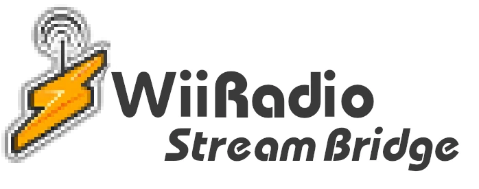
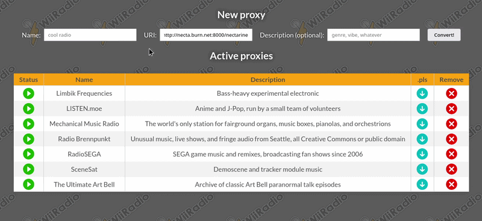

# 

WiiRadio is a long-abandoned, yet wonderful, homebrew application for the Nintendo Wii that allows users to listen to internet radio streams.  

The SHOUTcast search functionality has been deprecated for quite a while now, rendering the main purpose of the application to be the playback of pre-downloaded `.pls` or `.m3u` files. However, many of these files found in the present day will not run properly in WiiRadio.  

Modern internet radio often uses HTTPS and audio codecs that WiiRadio cannot understand. This tool provides a lightweight web interface to take any modern stream, transcode it into Wii-compatible audio using FFmpeg, and broadcast it over local HTTP via a bundled Icecast server.  

## Features

- **WebUI**: Simple interface to add, pause, resume, and remove streams  
- **On-the-fly transcoding**: Uses FFmpeg (`libmp3lame`) to convert incoming audio to 44.1 kHz, 128 kbps MP3 streams  
- **Playlist generation**: Automatically generates `.pls` playlist files for immediate playback in WiiRadio
- **Persistent across reboots**: Any stream running when the program exits will be stored in a local JSON file
- **Dockerized and lightweight**: Runs entirely in two containers  



## Prerequisites

- Docker and Docker Compose

## Installation

1. Clone the repository:  
```bash
git clone https://github.com/cmyksoda/wiiradio-stream-bridge.git
cd wiiradio-stream-bridge
```

2. Open `docker-compose.yml` and set your local IP address in the `HOST_IP` environment variable. Optionally, you can change the default Icecast passwords in both `docker-compose.yml` and `server.js`.  

## Usage

1. Start the containers:  
```bash
docker compose up --build -d
```  
2. Open your browser and navigate to `http://localhost:3000` to access the conversion utility.  
3. Enter a name, your target stream URI, and, optionally, a description.  
4. Click convert!  
5. Once the stream starts, click the download icon in the active proxies table to grab the `.pls` file, then place it in the `/apps/radiow/data/pls/` folder on your SD card.  
6. The proxy will serve the transcoded audio continuously over port 4000.

*Note: The server is coded to only allow 20 concurrent streams to play at any given time, with the last played stream paused when a new stream is added. You **can** change this functionality by modifying the* `const MAX_STREAMS = 20;` *line near the top of* `server.js` *, but this limitation was included simply to help with performance.*  

## Known Bugs

- Currently, metadata display in WiiRadio is iffy at best. [Progress will be updated here](https://github.com/cmyksoda/wiiradio-stream-bridge/issues/1)

## Credits & Acknowledgments

Of course, this project wouldn't exist without the work done by Scanff, Knarrff, and anyone else who has worked on WiiRadio in the past.  
Check out their repo [here](https://github.com/scanff/wiiradio).  

The lightning bolt/radio tower icon and the background asset used in the WebUI were both designed by TiMeBoMb, another member of the original team.  

CSS code for rendering the active proxies table was taken and modified from [this post](https://forum.obsidian.md/t/custom-css-for-tables-5-new-styles-ready-to-use-in-your-notes/17084) by user DeaconLight on the Obsidian Forums.

Wii Sans font, used in the lower half of the logo, is by [NotSoArtisty on DeviantArt.](https://www.deviantart.com/notsoartisty/art/Wii-Sans-v2-824335667)  

Finally, I highly recommend checking out [Deroverda's Recommended Radio Streams](https://github.com/deroverda/recommended-radio-streams) for a great collection of curated internet radio streams.
